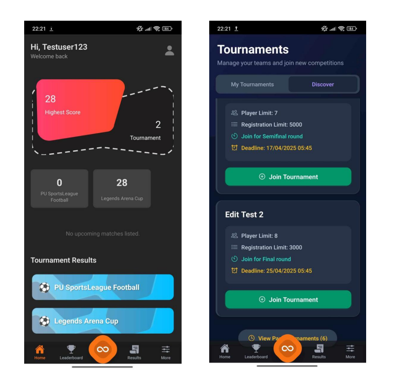

# 🏆 Fantasy Tournament SaaS - Backend

This is the backend API powering a SaaS platform that enables small-scale tournament organizers to host their own fantasy leagues for cricket, football, and other sports.

Built using Node.js, Express, and MongoDB, this backend allows organizers to:
- Host tournaments
- Add players
- Let users create teams within constraints (player count, budget, uniqueness)
- Track performance
- Manage user access and data securely

## 🧠 What is This?

> A plug-and-play backend for Fantasy Sports Tournaments as a Service  
Tournament organizers can sign up and use our system to let their audience play fantasy games without needing to build one themselves.

## 🎯 Key Features

### ✅ SaaS-Driven Design

- Multi-tenant style (one backend for many organizers)
- Tournament-based data separation
- Role-based access (`admin`, `user`)

### 👥 User & Auth

- Secure JWT-based authentication
- Signup/login for users and admins
- Middleware to verify access and permissions

### 🏟️ Tournament Management

- Admins can create & manage tournaments
- Set rules like number of players per team, deadlines

### 🧑‍🤝‍🧑 Players

- Add players with price, role, and team
- Filter/search players by role or team

### 🧩 Team Creation System

- Validate:
  - Player count
  - Budget constraint (e.g., max 100 points)
  - No duplicate players
- Prevent multiple teams per user per tournament
- Lock team changes after deadlines

## 🛠 Tech Stack

| Layer        | Technology         |
|--------------|--------------------|
| Language     | Node.js (ES6)      |
| Framework    | Express.js         |
| Database     | MongoDB + Mongoose |
| Auth         | JWT                |

## ⚙️ Project Structure

## 🚀 Getting Started
1. Clone the Repository
git clone https://github.com/Sanket2060/fantasy-system-backend1
cd fantasy-saas-backend
2. Install Dependencies
npm install

3. Set Up Environment Variables
Create a .env file in the root directory and setup with these variables
MongoDB_URI=
JWT_SECRET=
DB_NAME=fantasy
PORT=9005
CORS_ORIGIN=  
ACCESS_TOKEN_SECRET=
ACCESS_TOKEN_EXPIRY=1d
REFRESH_TOKEN_SECRET=
REFRESH_TOKEN_EXPIRY=10d

4. Start the Server
npm run dev
Server will run on http://localhost:9005

5.Frontend repo to this app:
https://github.com/Sanket2060/fantasy-sports-app

## 📸 Screenshots

